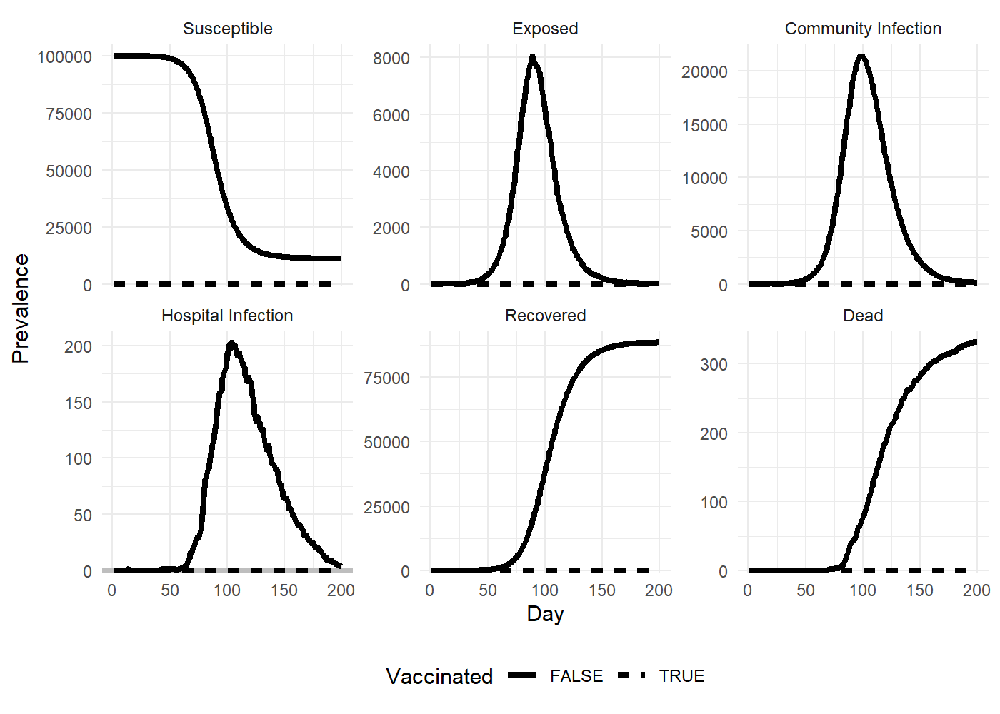
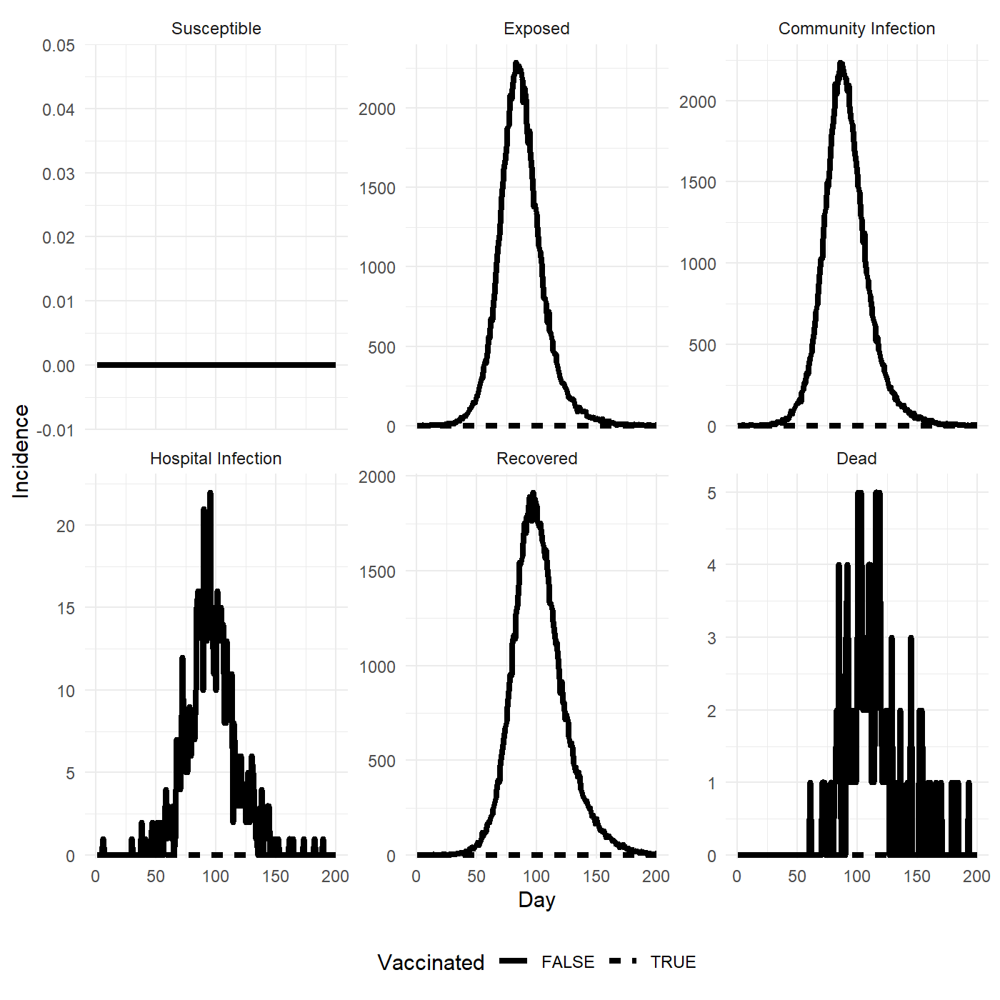
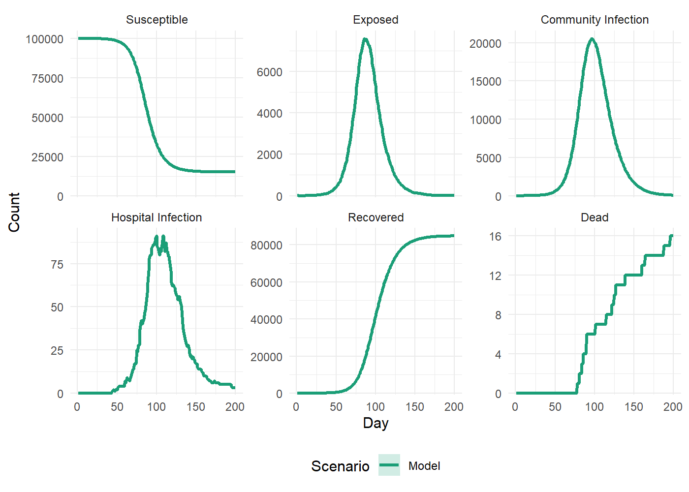
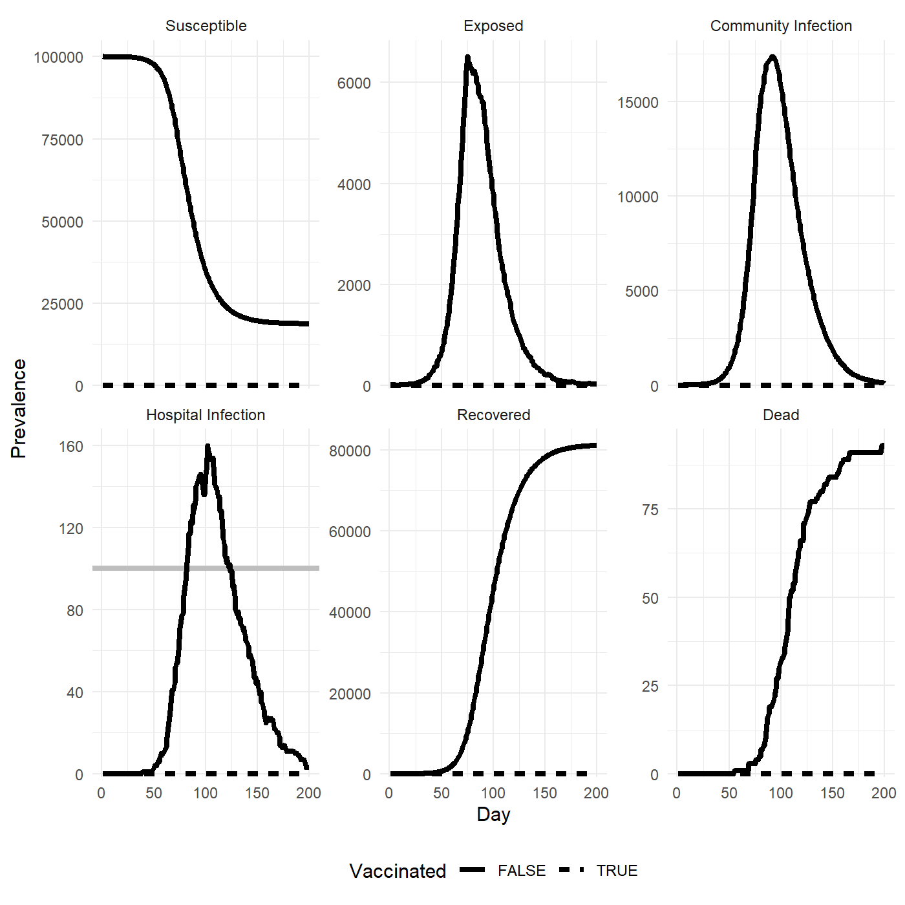
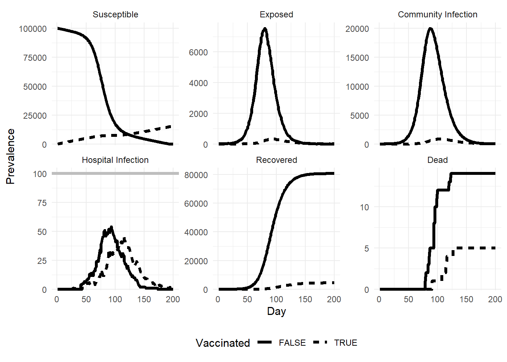

*simex*: a disease modelling tool for decision makers
---------------------------------------------------------------

[](LICENSE.md) [](https://lifecycle.r-lib.org/articles/stages.html#maturing)

*simex* is an R package for simulating the spread of infectious diseases, as well as interventions such as social distancing measures, isolation and vaccination. It uses an age-structured SEIR compartmental model with country-specific age demographics and contact rates.

The transmission model is written in the [**odin DSL**](https://mrc-ide.github.io/odin2/) in [`inst/odin/simex.R`](inst/odin/simex.R). That specification is compiled with [**dust2**](https://mrc-ide.github.io/dust2/) to C++ for fast discrete-time simulation (see the generated sources under `src/`). The main R entry point that uses this backend is `run_simex()`.


Installation
-------------

To install the development version from GitHub:


``` r
remotes::install_github("WHO-Collaboratory/simex")
```

Load the package using:

``` r
library(simex)
```

Running *simex*
-------------

### Shiny App

You can use *simex* interactively by launching the Shiny app locally with `simex::run_shiny()`. The app runs the same odin/dust2 model via `run_simex()`. If you want to use it programmatically, follow the steps below.

### Parameters and settings

Parameters are specified via `get_parameters()`. The arguments and their
default values are summarised below:


|Argument                |Description                                                                                                                                                                                                                                                      |Default value                                |
|:-----------------------|:----------------------------------------------------------------------------------------------------------------------------------------------------------------------------------------------------------------------------------------------------------------|:--------------------------------------------|
|iso3                    |The ISO3 code of the country used to draw age-distributions and contact rates from.                                                                                                                                                                              |"CMR"                                        |
|population              |Total population size (scalar) used to construct the initial state matrix passed to the model.                                                                                                                                                                   |1e+05                                        |
|R0                      |The basic reproduction number.                                                                                                                                                                                                                                   |3                                            |
|generation_time         |The mean generation time in days.                                                                                                                                                                                                                                |8                                            |
|incubation_period       |The mean incubation period in days.                                                                                                                                                                                                                              |3                                            |
|infectiousness_presymp  |Relative infectiousness of presymptomatic cases to symptomatic cases.                                                                                                                                                                                            |0.25                                         |
|frac_symp               |The proportion of cases that eventually develop symptoms.                                                                                                                                                                                                        |0.8                                          |
|ifr                     |Infection fatality rate provided either as a single value or as a vector of the same length as the number of age categories. Use the function age_to_ifr to calculate a COVID-like IFR from a vector of ages.                                                    |age_to_ifr(get_age_median())                 |
|hosp_mortality          |The probability of death given a case is admitted to hospital, either as a single value or as a vector of the same length as the number of age categories. The inverse of the number of cases admitted to hospital per death.                                    |1/seq(20, 5, length = 16)                    |
|hosp_protection_death   |Given a case requires hospitalisation, the proportion of deaths admission to hospital averts.                                                                                                                                                                    |0.75                                         |
|hosp_duration           |The mean duration of stay in the hospital in days, either as a single value or as a vector of the same length as the number of age categories.                                                                                                                   |seq(7, 21, length = 16)                      |
|hosp_capacity           |Total hospital bed capacity given as a proportion of the population.                                                                                                                                                                                             |100                                          |
|comm_mortality          |The probability of death of cases that remain in the community, either as a single value or as a vector of the same length as the number of age categories.                                                                                                      |rep(0, 16)                                   |
|vax_rate                |Number of vaccine doses administered per day (absolute count, not a proportion of the population).                                                                                                                                                               |0                                            |
|vax_infectiousness      |The reduction (as a proportion) in infectioussness of an individual due to vaccination.                                                                                                                                                                          |0.3                                          |
|vax_infection           |The protection (as a proportion) against infection provided by vaccination.                                                                                                                                                                                      |0.5                                          |
|vax_hosp                |The protection (as a proportion) against hospitalisation provided by vaccination, given infection.                                                                                                                                                               |0.5                                          |
|vax_death               |The protection (as a proportion) against death provided by vaccination, given hospitalisation.                                                                                                                                                                   |0.8                                          |
|isolation_adherence     |The proportion of symptomatic individuals that adhere to isolation measures.                                                                                                                                                                                     |0                                            |
|isolation_effectiveness |The reduction in daily transmission potential of a given individual due to adherence to isolation measures.                                                                                                                                                      |0.8                                          |
|isolation_delay         |The mean delay from symptom onset to isolation in days.                                                                                                                                                                                                          |3                                            |
|social_distancing       |A named vector of length 4 containing the proportion reduction in contacts due to social distancing of 'home', 'school', 'work' and 'other'.                                                                                                                     |c(home = 0, school = 0, work = 0, other = 0) |
|init_infections         |Total number of individuals infected at time zero, allocated across age groups by one multinomial draw with probabilities equal to the country age fractions.                                                                                                    |5                                            |
|init_compartment        |State column for the initial infection count (same meaning as init_infections). Typical value "Eu" (exposed, unvaccinated). Must match one of the twelve odin state names (Su/Eu/Cu/Hu/Ru/Du and Sv/Ev/Cv/Hv/Rv/Dv). Susceptibles in Su are reduced accordingly. |"Eu"                                         |
|vax_prioritised         |A logical indicating whether older age groups are vaccinated first.                                                                                                                                                                                              |TRUE                                         |
|hosp_prioritised        |A logical indicating whether older age groups are hospitalised first when hospital capacity is exceeded.                                                                                                                                                         |TRUE                                         |

### Running default settings

Pass the list from `get_parameters()` to `run_simex()` and set `time` to the
integer days you want the simulation to run.


``` r
# set parameters using defaults
pars <- get_parameters()

# run odin/dust2 model
output <- run_simex(pars, time = 1:200)

# look at output
print(output)
```

```

 [Simex Object]
 - Time: 1 to 200
 - Age Categories: age_1 to age_16
 - Compartments: S | E | C | H | R | D
 - Particles: 1
 - Samples: 1
```

### Visualising outputs

To visualise the results, use the generic `plot()` method for the `simex` class.
Below we visualise prevalence and then incidence via the `what` argument.


``` r
# visualise prevalence
plot(output, what = "prevalence")
```



``` r
# visualise incidence
plot(output, what = "incidence")
```



### Accessing outputs

Objects of class `simex` contain **`prevalence`** and **`incidence`**: long-format
`data.table`s with these columns:

* **`time`** — model day.
* **`age`** — age stratum.
* **`compartment`** — model compartment: `S`, `E`, `C`, `H`, `R`, or `D`.
* **`vax`** — logical indicating vaccination status.
* **`value`** — number of individuals.
* **`sample`** — indexes the row of `pars`
* **`particle`** — indexes the repeated stochastic simulations

The **`pars`** object passed into `run_simex()` is stored as **`output$pars`**.

Subset and aggregate with **`data.table`** syntax:


``` r
# one day, one compartment, unvaccinated susceptible only
output$prevalence[time == 150L & compartment == "S" & !vax]
```

```
       age compartment    vax  time value
    <fctr>      <fctr> <lgcl> <int> <num>
 1:  age_1           S  FALSE   150  2398
 2:  age_2           S  FALSE   150   444
 3:  age_3           S  FALSE   150   326
 4:  age_4           S  FALSE   150   501
 5:  age_5           S  FALSE   150  1027
 6:  age_6           S  FALSE   150  1036
 7:  age_7           S  FALSE   150  1005
 8:  age_8           S  FALSE   150   763
 9:  age_9           S  FALSE   150   596
10: age_10           S  FALSE   150   578
11: age_11           S  FALSE   150   488
12: age_12           S  FALSE   150   437
13: age_13           S  FALSE   150   491
14: age_14           S  FALSE   150   576
15: age_15           S  FALSE   150   426
16: age_16           S  FALSE   150   623
```


``` r
# all strata between days 10 and 20 (inclusive)
output$prevalence[time %between% c(10L, 20L)]
```

```
         age compartment    vax  time value
      <fctr>      <fctr> <lgcl> <int> <num>
   1:  age_1           S  FALSE    10 15452
   2:  age_2           S  FALSE    10 14013
   3:  age_3           S  FALSE    10 12342
   4:  age_4           S  FALSE    10 10777
   5:  age_5           S  FALSE    10  9070
  ---                                      
2108: age_12           D   TRUE    20     0
2109: age_13           D   TRUE    20     0
2110: age_14           D   TRUE    20     0
2111: age_15           D   TRUE    20     0
2112: age_16           D   TRUE    20     0
```

The **`extract()`** helper remains available (e.g. credible intervals when
`sample` or `particle` are present); for simple shaping, prefer **`data.table`**
as above.

```

### Passing parameters to `simex`

`run_simex()` accepts `pars` in three formats.

1. **Single list from `get_parameters()`** — the same parameter values apply for
   the whole simulation.

2. **Named list of parameters** — names must be **numeric strings** giving
   the **first model day** each parameter set applies from.

3. **Matrix of parameters** — **columns** represent the time breaks as in
   (2). **Rows** are **parallel runs** of the system with different
   parameter values, for example when simulating across a posterior
   distribution of parameters values.


### Modelling a single intervention

Vaccination is controlled with **`vax_rate`** (doses per day, not a proportion of
the population).


``` r
# vaccination rate: doses per day
pars <- get_parameters(vax_rate = 100)

output <- run_simex(pars, time = 1:200)

plot(output, what = "prevalence")
```



### Timed interventions (single system, parameters change over time)

One epidemic with isolation adherence stepping to `0.5` from day 75, using a
**named list** of parameter lists (equivalent to a **one-row matrix** with
column names `c("1", "75")`).


``` r
pars_timed <- list(
  "1" = get_parameters(),
  "75" = get_parameters(isolation_adherence = 0.5)
)

output_timed <- run_simex(pars_timed, time = 1:200)

plot(output_timed, what = "prevalence")
```



### Comparing different scenarios (separate runs)

Two **different** scenarios require two **`run_simex()`** calls, not a
multi-row `pars` matrix. Pass a **named list** of `simex` objects to
**`vis_comparison()`**.


``` r
scenario_pars <- list(
  "No intervention" = get_parameters(),
  "Isolation from day 75" = list(
    "1" = get_parameters(),
    "75" = get_parameters(isolation_adherence = 0.5)
  )
)

outputs <- lapply(scenario_pars, run_simex, time = 1:200)

vis_comparison(outputs)
```



## Contributors

- [Finlay Campbell](https://github.com/finlaycampbell) (campbellf@who.int)
- Prabasaj Paul (ppaul@who.int)

**Maintainer:** Finlay Campbell

## Licensing

The simex software is made available by Collaboratory (2024) under an [MIT license](LICENSE.md) ([citation file](CITATION.cff)).

The demographic data used in this software is made available by United Nations (2024) under a [Creative Commons license CC BY 3.0 IGO](http://creativecommons.org/licenses/by/3.0/igo/). Source:
> United Nations, Department of Economic and Social Affairs, Population Division (2024). [World Population Prospects 2024, Online Edition](https://population.un.org/wpp/).

The contact data used in this software is made available by Prem et al. (2017) under a [Creative Commons license CC BY 4.0](https://creativecommons.org/licenses/by/4.0/). Source:
> Kiesha Prem, Alex R. Cook, Mark Jit, *Projecting social contact matrices in 152 countries using contact surveys and demographic data*, PLoS Comp. Biol. (2017), https://doi.org/10.1371/journal.pcbi.1005697.
