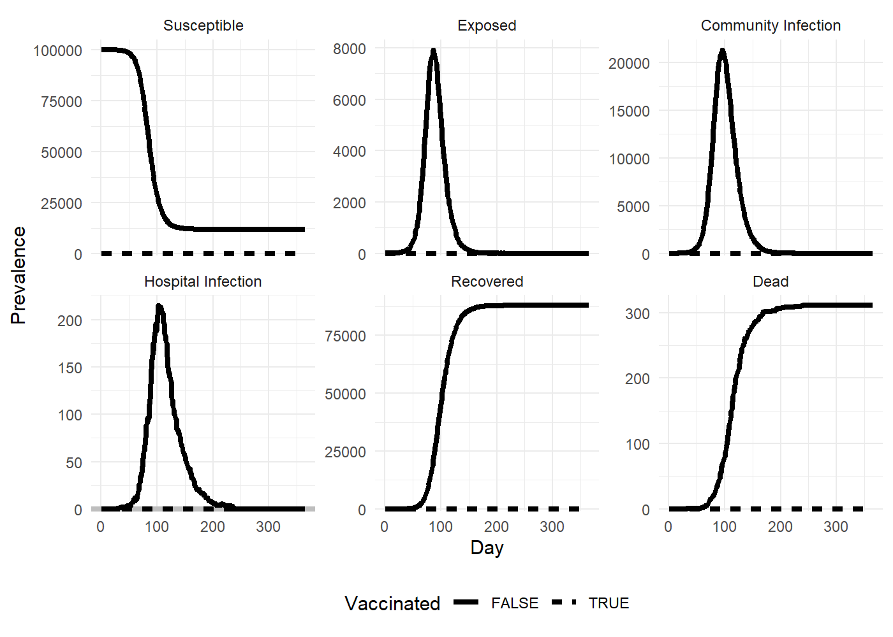
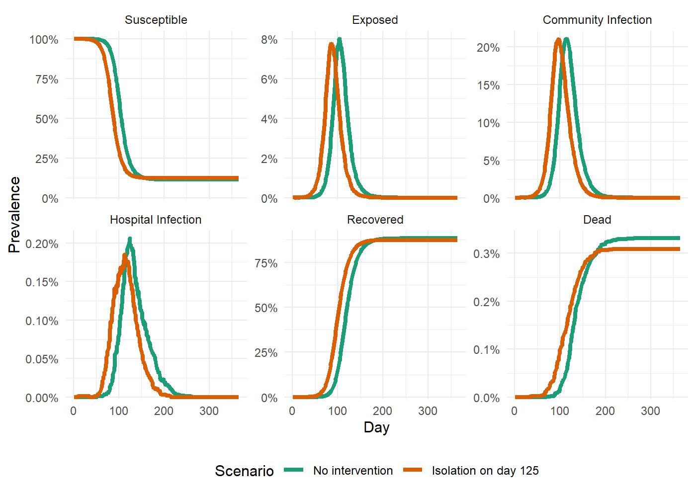

## *simex*: a disease modelling tool for decision makers

[](LICENSE.md)
[](https://lifecycle.r-lib.org/articles/stages.html#maturing)

*simex* is an R package for simulating the spread of infectious
diseases, as well as interventions such as social distancing measures,
isolation and vaccination. It uses an age-structured SEIR compartmental
model with country-specific age demographics and contact rates. The
simplest way to interact with the tool is to use the [Shiny
App](https://portal.who.int/eios-colab/rconnect/simex).

The transmission model is written in
[**odin**](https://mrc-ide.github.io/odin/) (odin2 DSL) in
[`inst/odin/simex.R`](inst/odin/simex.R). That specification is compiled
with [**dust2**](https://mrc-ide.github.io/dust2/) to C++ for fast
discrete-time simulation (see the generated sources under `src/`). The
main R entry point that uses this backend is `run_simex()`.

## Installation

To install the development version from github:

``` r
remotes::install_github("WHO-Collaboratory/simex")
```

Load the package using:

``` r
library(simex)
```

## Running *simex*

### Shiny App

You can use *simex* interactively by launching the Shiny app locally
with `simex::run_shiny()`. The app runs the same odin/dust2 model via
`run_simex()`. If you want to use it programmatically, follow the steps
below.

### Parameters and settings

Most settings are specified via `get_parameters()`. The arguments and
their default values are summarised below (from the roxygen
documentation):

| Argument | Description | Default value |
|:---|:---|:---|
| iso3 | The ISO3 code of the country used to draw age-distributions and contact rates from. | “CMR” |
| population | Total population size (scalar) used to construct the initial state matrix passed to the model. | 1e+05 |
| R0 | The basic reproduction number. | 3 |
| generation_time | The mean generation time in days. | 8 |
| incubation_period | The mean incubation period in days. | 3 |
| infectiousness_presymp | Relative infectiousness of presymptomatic cases to symptomatic cases. | 0.25 |
| frac_symp | The proportion of cases that eventually develop symptoms. | 0.8 |
| ifr | Infection fatality rate provided either as a single value or as a vector of the same length as the number of age categories. Use the function age_to_ifr to calculate a COVID-like IFR from a vector of ages. | age_to_ifr(get_age_median()) |
| hosp_mortality | The probability of death given a case is admitted to hospital, either as a single value or as a vector of the same length as the number of age categories. The inverse of the number of cases admitted to hospital per death. | 1/seq(20, 5, length = 16) |
| hosp_protection_death | Given a case requires hospitalisation, the proportion of deaths admission to hospital averts. | 0.75 |
| hosp_duration | The mean duration of stay in the hospital in days, either as a single value or as a vector of the same length as the number of age categories. | seq(7, 21, length = 16) |
| hosp_capacity | Total hospital bed capacity given as a proportion of the population. | 100 |
| comm_mortality | The probability of death of cases that remain in the community, either as a single value or as a vector of the same length as the number of age categories. | rep(0, 16) |
| vax_rate | Number of vaccine doses administered per day (absolute count, not a proportion of the population). | 0 |
| vax_infectiousness | The reduction (as a proportion) in infectioussness of an individual due to vaccination. | 0.3 |
| vax_infection | The protection (as a proportion) against infection provided by vaccination. | 0.5 |
| vax_hosp | The protection (as a proportion) against hospitalisation provided by vaccination, given infection. | 0.5 |
| vax_death | The protection (as a proportion) against death provided by vaccination, given hospitalisation. | 0.8 |
| isolation_adherence | The proportion of symptomatic individuals that adhere to isolation measures. | 0 |
| isolation_effectiveness | The reduction in daily transmission potential of a given individual due to adherence to isolation measures. | 0.8 |
| isolation_delay | The mean delay from symptom onset to isolation in days. | 3 |
| social_distancing | A named vector of length 4 containing the proportion reduction in contacts due to social distancing of ‘home’, ‘school’, ‘work’ and ‘other’. | c(home = 0, school = 0, work = 0, other = 0) |
| init_infections | Total number of individuals infected at time zero, allocated across age groups by one multinomial draw with probabilities equal to the country age fractions. | 5 |
| init_compartment | State column for the initial infection count (same meaning as init_infections). Typical value “Eu” (exposed, unvaccinated). Must match one of the twelve odin state names (Su/Eu/Cu/Hu/Ru/Du and Sv/Ev/Cv/Hv/Rv/Dv). Susceptibles in Su are reduced accordingly. | “Eu” |
| vax_prioritised | A logical indicating whether older age groups are vaccinated first. | TRUE |
| hosp_prioritised | A logical indicating whether older age groups are hospitalised first when hospital capacity is exceeded. | TRUE |

### Passing parameters to `run_simex()`

`run_simex()` accepts `pars` in three equivalent shapes. In each case
you are simulating **one** underlying system (one epidemic process);
only the layout of inputs differs.

1.  **Single list from `get_parameters()`** — the same parameter values
    apply for the whole simulation. Internally this is turned into a
    one-column matrix whose column name is the first time in `time`.

2.  **Named list of parameter lists** — names must be **numeric
    strings** giving the **first model day** each parameter set applies
    from (e.g. `"1"`, `"75"`). The list is coerced to a one-row matrix
    with those names as column names. One name must correspond to the
    start of the simulation (typically `"1"`).

3.  **Matrix of lists** — **columns** are the same time breaks as in
    (2): each column is one parameter list for that segment. **Rows**
    are **parallel runs** of the same calendar schedule (e.g. rows =
    posterior draws). The simulator uses `dust2` groups so each row is
    independent; outputs then include a **`sample`** column indexing the
    row (parallel draw). With `n_particles > 1` you also get a
    **`particle`** column for stochastic replicates within each run.

To compare **different scenarios as different models** (e.g. “no
vaccine” vs “high vaccine”), run **`run_simex()` separately** for each
scenario and collect the `simex` objects in a list, then pass that list
to `vis_comparison()`. For example:
`lapply(list_of_par_lists, run_simex, time = 1:200)` or, with
**`purrr`**,
`purrr::map(list_of_par_lists, \(p) run_simex(p, time = 1:200))`.

### Running default settings

Pass the list from `get_parameters()` to `run_simex()` and set `time` to
the integer days you want (inclusive).

``` r
# set parameters using defaults
pars <- get_parameters()

# run odin/dust2 model (example: days 1–200)
output <- run_simex(pars, time = 1:200)

# look at output
print(output)
```


     [Simex Object]
     - Time: 1 to 200
     - Age Categories: age_1 to age_16
     - Compartments: S | E | C | H | R | D
     - Particles: 1
     - Samples: 1

The **`print()`** summary lines mean: **Time** — range of simulated
days; **Age categories** — factor levels in the output tables;
**Compartments** — epidemic stages (`S` … `D`); **Particles** —
stochastic replicates (`1` with the default single particle; larger when
`n_particles > 1`); **Samples** — parallel parameter groups (`1` with a
single-row `pars`; larger when `pars` has multiple matrix rows,
e.g. posterior draws).

In **`output$prevalence`** and **`output$incidence`** (both
`data.table`s):

- **`time`** — model day.
- **`age`** — age stratum (`age_1`, …).
- **`compartment`** — `S`, `E`, `C`, `H`, `R`, or `D`.
- **`vax`** — `TRUE` / `FALSE` for vaccinated vs unvaccinated strata.
- **`value`** — count in that stratum (or flow for incidence).
- **`sample`** — present when `pars` is a matrix with **multiple rows**
  (parallel draws); indexes the row of `pars`.
- **`particle`** — present when `n_particles > 1`.

### Visualising outputs

To visualise the results, use the generic `plot` function defined for
the `simex` class. Below, we first visualise prevalence and then
incidence, specified using the `what` argument.

``` r
# visualise prevalence
plot(output, what = "prevalence")
```


``` r
# visualise incidence
plot(output, what = "incidence")
```


Hospital capacity can be displayed by toggling the `show_hosp_capacity`
argument.

``` r
# visualise prevalence with hospital capaciy
plot(output, what = "prevalence", show_hosp_capacity = TRUE)
```


### Accessing outputs

Objects returned by `run_simex()` have class `simex` and contain:

- **`prevalence`** — long-format `data.table` (see column definitions
  above).
- **`incidence`** — same layout; **`value`** is the daily flow into each
  compartment (see `?extract` for interpretation by letter).
- **`pars`** — the `pars` object passed into `run_simex()` (often a
  matrix of lists when using time-varying or multi-row input).

Subset and aggregate with **`data.table`** syntax on `output$prevalence`
or `output$incidence`:

``` r
# one day, one compartment, unvaccinated susceptible only
output$prevalence[time == 150L & compartment == "S" & !vax]
```

           age compartment    vax  time value
        <fctr>      <fctr> <lgcl> <int> <num>
     1:  age_1           S  FALSE   150  2548
     2:  age_2           S  FALSE   150   438
     3:  age_3           S  FALSE   150   338
     4:  age_4           S  FALSE   150   505
     5:  age_5           S  FALSE   150  1075
     6:  age_6           S  FALSE   150  1074
     7:  age_7           S  FALSE   150   993
     8:  age_8           S  FALSE   150   888
     9:  age_9           S  FALSE   150   657
    10: age_10           S  FALSE   150   588
    11: age_11           S  FALSE   150   513
    12: age_12           S  FALSE   150   457
    13: age_13           S  FALSE   150   479
    14: age_14           S  FALSE   150   582
    15: age_15           S  FALSE   150   419
    16: age_16           S  FALSE   150   627

``` r
# all strata between days 10 and 20 (inclusive)
output$prevalence[time %between% c(10L, 20L)]
```

             age compartment    vax  time value
          <fctr>      <fctr> <lgcl> <int> <num>
       1:  age_1           S  FALSE    10 15452
       2:  age_2           S  FALSE    10 14013
       3:  age_3           S  FALSE    10 12343
       4:  age_4           S  FALSE    10 10776
       5:  age_5           S  FALSE    10  9069
      ---                                      
    2108: age_12           D   TRUE    20     0
    2109: age_13           D   TRUE    20     0
    2110: age_14           D   TRUE    20     0
    2111: age_15           D   TRUE    20     0
    2112: age_16           D   TRUE    20     0

``` r
# total in hospital by day and vaccination status
output$prevalence[
  compartment == "H",
  .(hospitalised = sum(value)),
  by = .(time, vax)
]
```

          time    vax hospitalised
         <int> <lgcl>        <num>
      1:     1  FALSE            0
      2:     1   TRUE            0
      3:     2  FALSE            0
      4:     2   TRUE            0
      5:     3  FALSE            0
     ---                          
    396:   198   TRUE            0
    397:   199  FALSE           10
    398:   199   TRUE            0
    399:   200  FALSE           10
    400:   200   TRUE            0

The **`extract()`** helper is still available for convenience
(e.g. credible intervals when `sample` or `particle` are present); for
simple shaping, prefer **`data.table`** on the stored tables as above.

### Modelling a single intervention

We consider vaccination as an example intervention, using the `vax_rate`
argument to specify the number of doses per day.

``` r
# define vaccination rate (doses per day)
pars <- get_parameters(vax_rate = 100)

# run model
output <- run_simex(pars, time = 1:200)

# visualise prevalence
plot(output)
```


We can see that the daily increase in number of vaccinated individuals,
as well as the impact on infection and disease severity.

### Timed interventions (single system, parameters change over time)

Below, **one** epidemic is simulated with isolation adherence stepping
to `0.5` from day 75. This uses a **named list** of parameter lists; a
**one-row matrix** with column names `c("1", "75")` would be equivalent.

``` r
pars_timed <- list(
  "1" = get_parameters(),
  "75" = get_parameters(isolation_adherence = 0.5)
)

output_timed <- run_simex(pars_timed, time = 1:200)

plot(output_timed, what = "prevalence")
```



### Comparing different scenarios (separate runs)

Here we simulate **two different scenarios** as **two calls** to
`run_simex()` and collect two `simex` objects. That differs from a
multi-column `pars` matrix, which varies parameters over time for
**one** scenario with parallel draws across rows.

`vis_comparison()` takes a **named list** of `simex` objects (one per
scenario).

``` r
scenario_pars <- list(
  "No intervention" = get_parameters(),
  "Isolation from day 75" = list(
    "1" = get_parameters(),
    "75" = get_parameters(isolation_adherence = 0.5)
  )
)

outputs <- lapply(scenario_pars, run_simex, time = 1:200)

vis_comparison(outputs)
```



The same idea works with **`purrr::map()`** if you prefer a tidyverse
style,
e.g. `purrr::map(scenario_pars, \(p) run_simex(p, time = 1:200))`.

## \### Contributors

- [Finlay Campbell](https://github.com/finlaycampbell)
  (<campbellf@who.int>)
- Prabasaj Paul (<ppaul@who.int>)

**Maintainer:** Finlay Campbell

### Licensing

The simex software is made available by Collaboratory (2024) under an
[MIT license](LICENSE.md) ([citation file](CITATION.cff)).

The demographic data used in this software is made available by United
Nations (2024) under a [Creative Commons license CC BY 3.0
IGO](http://creativecommons.org/licenses/by/3.0/igo/). Source: \> United
Nations, Department of Economic and Social Affairs, Population Division
(2024). [World Population Prospects 2024, Online
Edition](https://population.un.org/wpp/).

The contact data used in this software is made available by Prem et
al. (2017) under a [Creative Commons license CC BY
4.0](https://creativecommons.org/licenses/by/4.0/). Source: \> Kiesha
Prem, Alex R. Cook, Mark Jit, *Projecting social contact matrices in 152
countries using contact surveys and demographic data*, PLoS Comp. Biol.
(2017), <https://doi.org/10.1371/journal.pcbi.1005697>.
