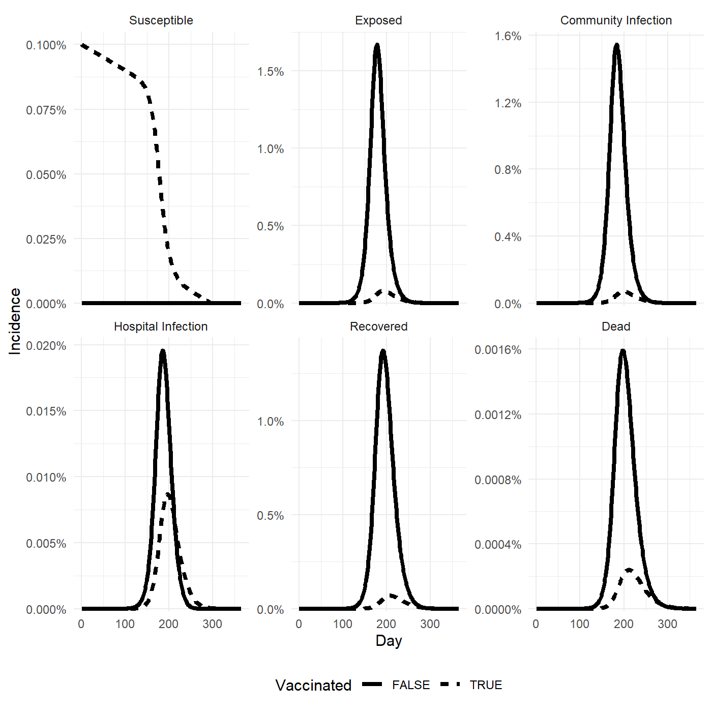
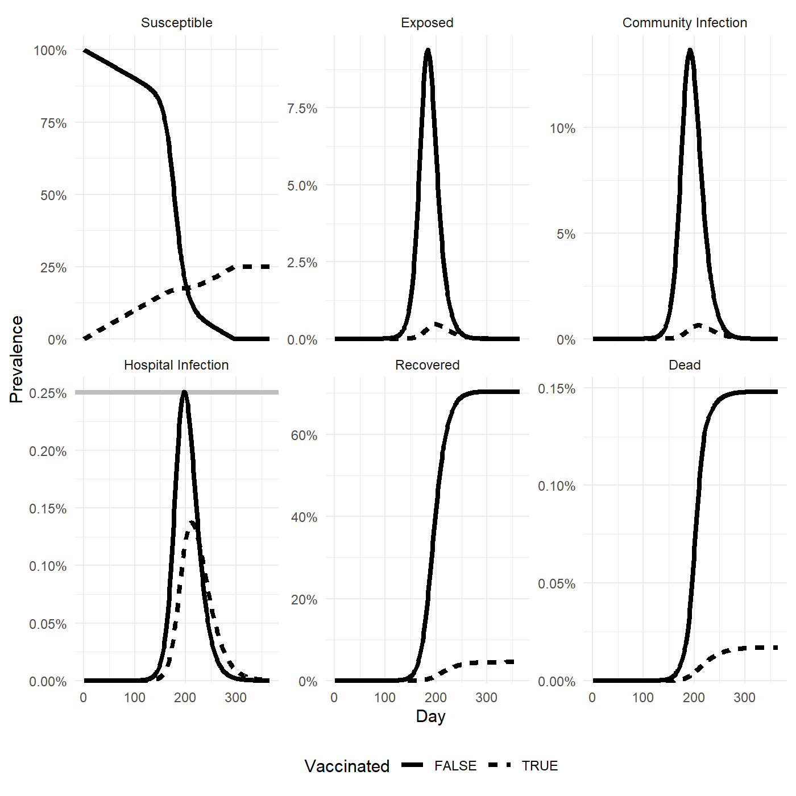
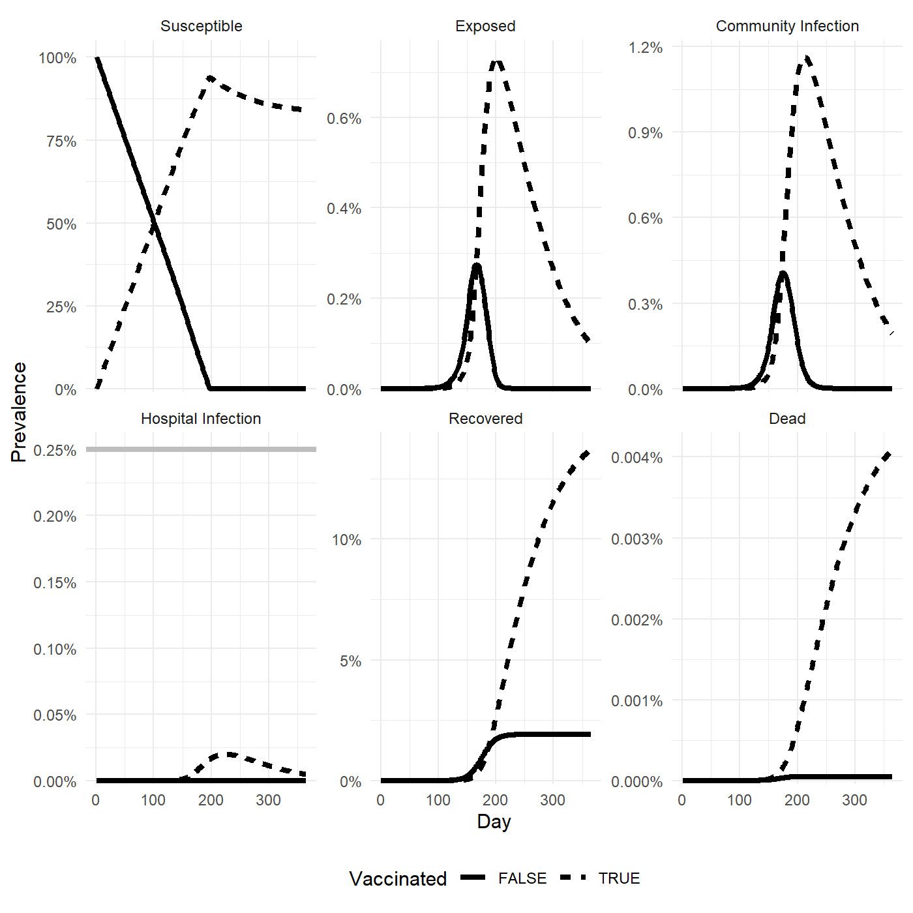
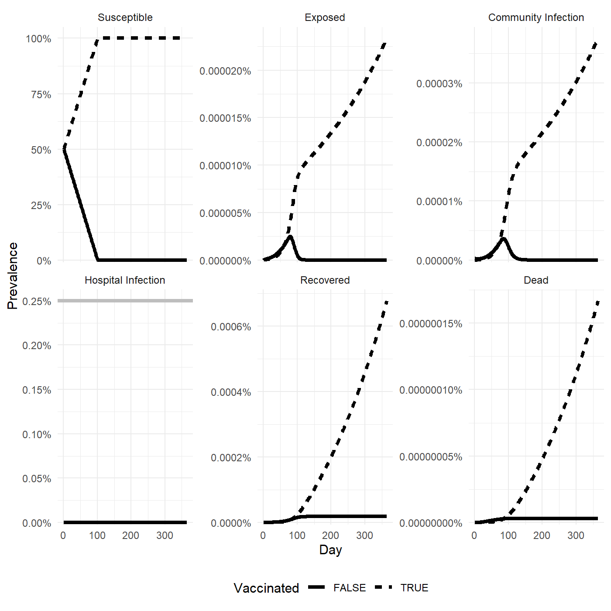
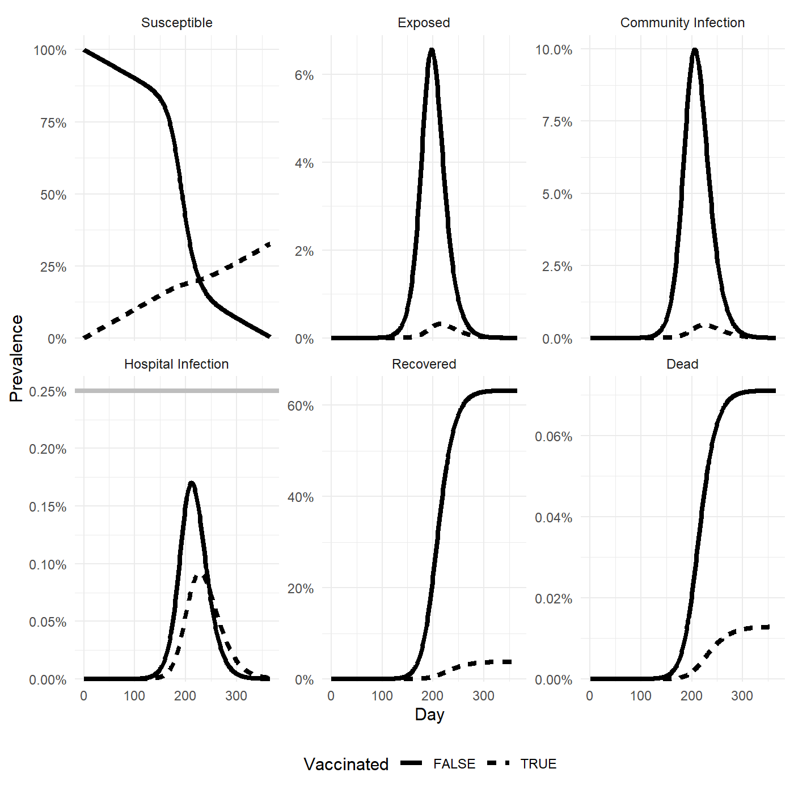
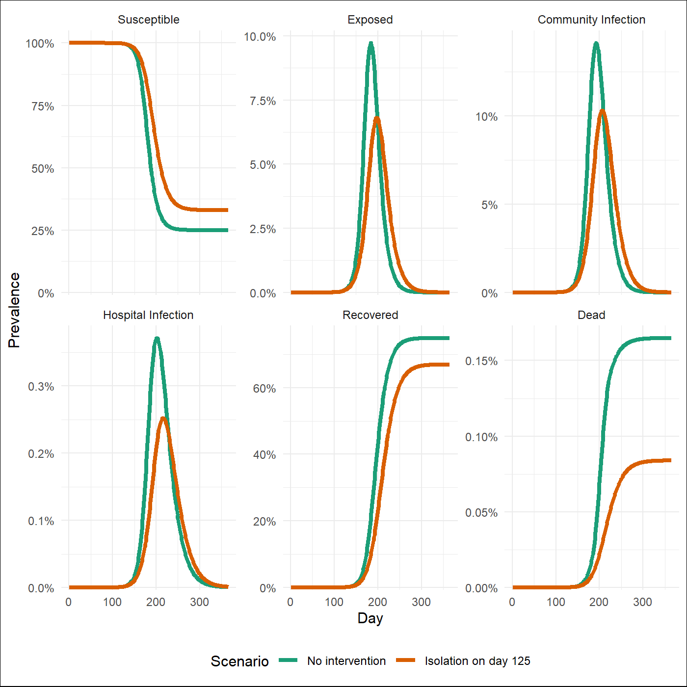

*simex*: a disease modelling tool for decision makers
---------------------------------------------------------------

[](https://github.com/epiforecasts/EpiNow2/blob/main/LICENSE.md/) [](https://lifecycle.r-lib.org/articles/stages.html#maturing)

*simex* is an R package for simulating the spread of infectious diseases, as
well as interventions such as social distancing measures, isolation and
vaccination. It uses an age-structured SEIR compartmental model with
country-specific age demographics and contact rates. The simplest way to
interact with the tool is to use the [Shiny App](https://portal.who.int/eios-colab/rconnect/simex).


Installation
-------------

To install the development version from github:


``` r
remotes::install_github("WHO-Collaboratory/simex", dependencies = TRUE, force = TRUE)
```

Load the package using:


``` r
library("simex")
```

Running *simex*
-------------

### Shiny App
You can use *simex* interactively by launching the shiny app locally with
`simex::run_shiny()`. If you want to use it programmatically, follow the steps
below.

### Parameters and settings

Most settings are specified via the `get_parameters` function. The arguments and
their default values are given below:


|Argument                |Description                                                                                                                                                                                                                   |Default value                                |
|:-----------------------|:-----------------------------------------------------------------------------------------------------------------------------------------------------------------------------------------------------------------------------|:--------------------------------------------|
|iso3                    |The ISO3 code of the country used to draw age-distributions and contact rates from.                                                                                                                                           |"USA"                                        |
|R0                      |The basic reproduction number.                                                                                                                                                                                                |3                                            |
|generation_time         |The mean generation time in days.                                                                                                                                                                                             |10                                           |
|incubation_period       |The mean incubation period in days.                                                                                                                                                                                           |6                                            |
|infectiousness_presymp  |Relative infectiousness of presymptomatic cases to symptomatic cases.                                                                                                                                                         |0.25                                         |
|frac_symp               |The proportion of cases that eventually develop symptoms.                                                                                                                                                                     |0.8                                          |
|ifr                     |Infection fatality rate provided either as a single value or as a vector of the same length as the number of age categories. Use the function 'age_to_ifr' to calculate a COVID-like IFR from a vector of ages.               |age_to_ifr(get_age_median())                 |
|hosp_mortality          |The probability of death given a case is admitted to hospital, either as a single value or as a vector of the same length as the number of age categories. The inverse of the number of cases admitted to hospital per death. |1/seq(20, 5, length = 16)                    |
|hosp_protection_death   |Given a case requires hospitalisation, the proportion of deaths admission to hospital averts.                                                                                                                                 |0.75                                         |
|hosp_duration           |The mean duration of stay in the hospital in days, either as a single value or as a vector of the same length as the number of age categories.                                                                                |seq(7, 21, length = 16)                      |
|hosp_capacity           |Total hospital bed capacity given as a proportion of the population.                                                                                                                                                          |0.0025                                       |
|comm_mortality          |The probability of death of cases that remain in the community, either as a single value or as a vector of the same length as the number of age categories.                                                                   |rep(0, 16)                                   |
|vax_rate                |The daily rate of vaccination as a proportion of the population.                                                                                                                                                              |0.001                                        |
|vax_infectiousness      |The reduction (as a proportion) in infectioussness of an individual due to vaccination.                                                                                                                                       |0.3                                          |
|vax_infection           |The protection (as a proportion) against infection provided by vaccination.                                                                                                                                                   |0.5                                          |
|vax_hosp                |The protection (as a proportion) against hospitalisation provided by vaccination, given infection.                                                                                                                            |0.5                                          |
|vax_death               |The protection (as a proportion) against death provided by vaccination, given hospitalisation.                                                                                                                                |0.8                                          |
|isolation_adherence     |The proportion of symptomatic individuals that adhere to isolation measures.                                                                                                                                                  |0                                            |
|isolation_effectiveness |The reduction in daily transmission potential of a given individual due to adherence to isolation measures.                                                                                                                   |0.8                                          |
|isolation_delay         |The mean delay from symptom onset to isolation in days.                                                                                                                                                                       |3                                            |
|social_distancing       |A named vector of length 4 containing the proportion reduction in contacts due to social distancing of 'home', 'school', 'work' and 'other'.                                                                                  |c(home = 0, school = 0, work = 0, other = 0) |
|vax_prioritised         |A logical indicating whether older age groups are vaccinated first.                                                                                                                                                           |TRUE                                         |
|hosp_prioritised        |A logical indicating whether older age groups are hospitalised first when hospital capacity is exceeded.                                                                                                                      |TRUE                                         |

### Running default settings

To run the model using default settings, specify a parameter object `par` and
feed this into the `run_model` function.


``` r
## set parameters using defaults
pars <- get_parameters()

## run model using default parameters
output <- run_model(pars)

## look at output
print(output)
```

```
## 
##  [Simex Object]
##  - Days: 1 to 365
##  - Age Categories: age_1 to age_16
##  - Compartments: S_u | E_u | C_u | H_u | R_u | D_u | S_v | E_v | C_v | H_v | R_v | D_v
```

### Visualising outputs

To visualise the results, use the generic `plot` function defined for the
`simex` class. Below, we first visualise prevalence and then incidence,
specified using the `what` argument.


``` r
## visualise prevalence
plot(output, what = "prevalence")
```


``` r
## visualise incidence
plot(output, what = "incidence")
```



Hospital capacity can be displayed by toggling the `show_hosp_capacity`
argument.


``` r
## visualise prevalence with hospital capaciy
plot(output, what = "prevalence", show_hosp_capacity = TRUE)
```



### Summarising outputs

To get a summary of the model state at a given point in time, use the `summary`
function with the optional `day` argument. In the example below, we display the
summary statistics for day 150:


``` r
## get summary at day 150
summary(output, day = 150)
```

|statistic                            |     value|
|:------------------------------------|---------:|
|incidence_last_7                     | 0.0026936|
|incidence_cumulative                 | 0.0370007|
|incidence_weekly_change              | 1.0051376|
|death_last_7                         | 0.0000007|
|death_cumulative                     | 0.0000103|
|death_weekly_change                  | 1.0257307|
|hosp_admission_last_7                | 0.0000211|
|hosp_admission_cumulative            | 0.0002897|
|hosp_admission_weekly_change         | 1.0261607|
|hospital_occupancy                   | 0.0698724|
|proportion_cases_hospitalised_last_7 | 0.0077865|
|ifr_last_7                           | 0.0002768|
|ifr_cumulative                       | 0.0002774|


### Accessing outputs

The `output` object is of class `simex` and is a list containing four items:

* `prevalence` is an array with 3 dimensions: time (365 days) x age (16
  categories) x state (12 compartments). The compartments are S (susceptible), E
  (exposed, pre-symptomatic), C (symptomatic in community), H (sympomatic in
  hospital), R (recovered), D (dead). Each comparment is split into unvaccinated
  (with subscript _u) and vaccinated (with subscript _v). Each value in the
  array represents the proportion of the population in that given age-disease
  compartment on a given day.
* `deltas` is an array with the same dimensions as `prevalence`. Each value
  represents the change in a given age-disease compartment from the previous
  day.
* `incidence` is an array with the same dimensions as `prevalence`. Each value
  represents the new additions to a given age-disease comparment on a given
  day. For the exposed category E, this represents incidence of new infections,
  for the hospitalised category H this represents new hospital admissions, and
  for the dead category D this represents new deaths.
* `pars` contains the parameter set initially fed into `run_model`.

Accessing the data is easiest using array indexing. Remember, the dimensions are
time, age and compartment. For example, accessing the prevalence on the 250th
day is done with `output$prevalence[250,,]`:


```
##         state
## age      S_u E_u C_u H_u R_u D_u S_v E_v C_v H_v R_v D_v
##   age_1  1.3   0 0.1   0 4.1   0 0.0   0 0.0   0 0.0   0
##   age_2  0.6   0 0.1   0 5.2   0 0.0   0 0.0   0 0.0   0
##   age_3  0.3   0 0.1   0 5.8   0 0.0   0 0.0   0 0.0   0
##   age_4  0.1   0 0.0   0 6.4   0 0.0   0 0.0   0 0.0   0
##   age_5  0.6   0 0.1   0 5.9   0 0.0   0 0.0   0 0.0   0
##   age_6  0.6   0 0.1   0 5.9   0 0.0   0 0.0   0 0.0   0
##   age_7  0.7   0 0.1   0 6.2   0 0.0   0 0.0   0 0.0   0
##   age_8  0.5   0 0.1   0 6.1   0 0.0   0 0.0   0 0.0   0
##   age_9  0.1   0 0.1   0 5.9   0 0.4   0 0.0   0 0.0   0
##   age_10 0.0   0 0.1   0 5.2   0 0.6   0 0.0   0 0.0   0
##   age_11 0.0   0 0.1   0 5.2   0 0.8   0 0.0   0 0.0   0
##   age_12 0.0   0 0.1   0 4.6   0 1.4   0 0.0   0 0.1   0
##   age_13 0.0   0 0.0   0 2.4   0 3.2   0 0.1   0 0.6   0
##   age_14 0.0   0 0.0   0 0.1   0 4.2   0 0.1   0 1.3   0
##   age_15 0.0   0 0.0   0 0.0   0 3.6   0 0.0   0 0.9   0
##   age_16 0.0   0 0.0   0 0.0   0 6.3   0 0.0   0 1.1   0
```

Accessing the prevalence of the 1st age compartment (0-4) and 1st infectious
compartment (unvaccinated susceptible) for days 130 to 135 is done with
`output$prevalence[130:135,1,1]`:


```
## day_130 day_131 day_132 day_133 day_134 day_135 
##     5.5     5.5     5.5     5.5     5.5     5.5
```

The outputs can also be extracted in `tibble` form using the `extract` function,
once again using the `what` argument to specify whether prevalence or incidence
is extracted.


``` r
## extract prevalence
extract(output, what = "prevalence")
```

```
## # A tibble: 4,380 × 4
##      day vax   compartment         value
##    <int> <lgl> <fct>               <dbl>
##  1     1 FALSE S           1.00         
##  2     1 FALSE E           0            
##  3     1 FALSE C           0.00000000293
##  4     1 FALSE H           0            
##  5     1 FALSE R           0            
##  6     1 FALSE D           0            
##  7     1 TRUE  S           0            
##  8     1 TRUE  E           0            
##  9     1 TRUE  C           0            
## 10     1 TRUE  H           0            
## # ℹ 4,370 more rows
```
If we want to filter this list for a sequence of days, we can then do basic
dataframe manipulation:


``` r
## define start and end days
days_from <- 10
days_to <- 20

## extract prevalence
df <- extract(output, what = "prevalence")
df <- df[df$day %in% seq(days_from, days_to),]
df
```

```
## # A tibble: 132 × 4
##      day vax   compartment    value
##    <int> <lgl> <fct>          <dbl>
##  1    10 FALSE S           9.91e- 1
##  2    10 FALSE E           3.60e- 9
##  3    10 FALSE C           3.33e- 9
##  4    10 FALSE H           5.35e-11
##  5    10 FALSE R           2.48e- 9
##  6    10 FALSE D           1.45e-12
##  7    10 TRUE  S           9.00e- 3
##  8    10 TRUE  E           2.10e-12
##  9    10 TRUE  C           6.97e-13
## 10    10 TRUE  H           2.06e-13
## # ℹ 122 more rows
```

### Modelling a single intervention

We use vaccination as an example intervention. Referencing the table above, we
can see that vaccination rate is specified using the `vax_rate` argument and
set it to 0.5% of the population per day.


``` r
## define vaccination rate
pars <- get_parameters(vax_rate = 0.005)

## run model
output <- run_model(pars)

## visualise prevalence
plot(output)
```



We can see that the daily increase in number of vaccinated individuals, as
well as the impact on infection and disease severity.


### Specifying an initial state

The default initial state begins with an entirely susceptible, unvaccinated
population and a single infection. We can also specify a custom initial state by
passing a matrix specifying the number of individuals in each age-infection
compartment. In the example below, we extract the initial state from the
previous run, and modify the compartments so half the susceptible population is
assigned to the vaccinated compartment.


``` r
## extract starting point from previous run
state <- output$prevalence[1,,]

## assign half of susceptibles to vaccinated
state[,"S_u"] <- state[,"S_v"] <- state[,"S_u"]/2

## run model
output <- run_model(pars, init_state = state)

## visualise prevalence
plot(output)
```



We can see that the simulation now begins with a 50% vaccinated population,
significantly reducing the size and impact of the pandemic.

### Timed interventions, multiple interventions

Sometime we only want to introduce interventions at a certain time, or we want
to model multiple, successive interventions. We can do this easily by generating
a named list of parameters, where the name gives the time that parameter set
should be used from. In the example below, we introduce isolation measures with
an adherence of 50% on the 125th day.


``` r
## introduce isolation on the 125th day
parlist <- list(
  "1" = get_parameters(),
  "125" = get_parameters(isolation_adherence = 0.5)
)

## run model
output <- run_model(parlist)

## visualise prevalence
plot(output)
```



Comparing this figure with the first model run with no interventions, we can see
the proportion of deaths drops from about 0.7% to 0.4%; a reduction in deaths of
more than 40%!

### Comparing scenarios

It is useful to directly compare different scenarios visually. The
`vis_comarison` function does exactly this, and accepts a named list of `simex`
objects. In the example below, we generate a named list of lists that compares
the default scenario (no interventions) with the a scenario where isolation is
introduced on the 125th day.
	

``` r
## define two scenarios, one without intervention and one with isolation
parlists <- list(
  "No intervention" = get_parameters(),
  "Isolation on day 125" = list(
    "1" = get_parameters(),
    "125" = get_parameters(isolation_adherence = 0.5)
  )
)

## run model across set of parameter lists
outputs <- lapply(parlists, run_model)

## compare scenarios
vis_comparison(outputs)
```



### Contributors
------------
- [Finlay Campbell](https://github.com/finlaycampbell) (campbellf@who.int)
- Prabasaj Paul (ppaul@who.int)

**Maintainer:** Finlay Campbell


### Licensing

The simex software is made available by Collaboratory (2024) under an [MIT license](LICENSE.md) ([citation file](CITATION.cff)).

The demographic data used in this software is made available by United Nations (2024) under a [Creative Commons license CC BY 3.0 IGO](http://creativecommons.org/licenses/by/3.0/igo/). Source:
> United Nations, Department of Economic and Social Affairs, Population Division (2024). [World Population Prospects 2024, Online Edition](https://population.un.org/wpp/).

The contact data used in this software is made available by Prem et al. (2017) under a [Creative Commons license CC BY 4.0](https://creativecommons.org/licenses/by/4.0/). Source:
> Kiesha Prem, Alex R. Cook, Mark Jit, *Projecting social contact matrices in 152 countries using contact surveys and demographic data*, PLoS Comp. Biol. (2017), https://doi.org/10.1371/journal.pcbi.1005697.
